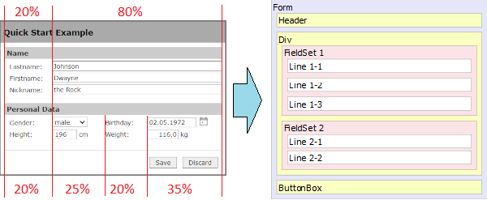
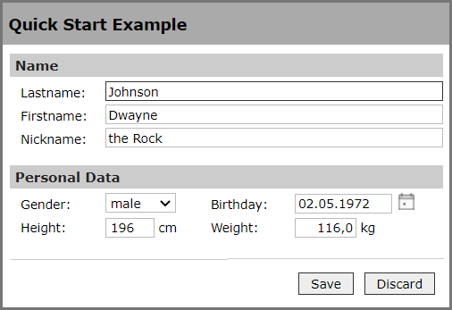
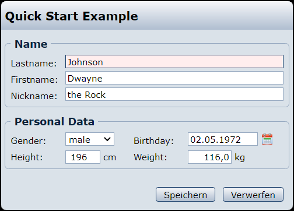

# Quick Start for the Formgenerator

This blog contains a general introduction to designing and creating a form 
with the form generator package. For a better understanding, the individual 
steps are gradually explained using a simple example.

## Overview
1. [Designing the Form](#chapter-1)
   - [The first Steps](#chapter-1-1)
   - [Basic structure of the Form](#chapter-1-2) 
   - [Creating the input Elements](#chapter-1-3)
   - [Bring up the form to the Page](#chapter-1-4)
2. [Connecting the form with Data](#chapter-2)
   - [The data to be processed by the Form](#chapter-2-1)
   - [Specifying select options](#chapter-2-2)

<a name="chapter-1"></a>
## 1. Designing the Form
The basis of every form is an instance of the `FormGenerator` class or 
the `XMLForm` class (which is an extension of `FormGenerator`) if 
the form is to be read from an XML definition file.

> **Coding the form direct in PHP or using an XML file?**   
> In principle, (almost) all functions of the package are available when 
> defining a form using an XML file. Which of the two methods is used depends 
> on the one hand on the particular preferences of the developer, or on 
> whether the form to be created always has exactly the same structure or not.  
> If, for example, due to user rights or other externally changeable factors, 
> different elements of the form are to be shown / hidden or provided with 
> write protection, this can only be implemented by direct coding!

For the Quick Start we first choose the direct coding in PHP. The complete 
source can be found in the example directory of the package *(QuickStart.php)*.
The XML-Version is also in this directory 
*(QuickStartXML.php and xml/QuickStart.xml)*

<a name="chapter-1-1"></a>
### 1.1. The first Steps

```php
declare(strict_types=1);

require_once '../autoloader.php';

use SKien\Config\JSONConfig;
use SKien\Formgenerator\ArrayFormData;
use SKien\Formgenerator\FormGenerator;
use ...

// defining data array for test purposes
...

// creating the main form instance
$oFG = new FormGenerator($oData);

// load the configuration to use
$oConfig = new JSONConfig('./MSO-Theme/FormGenerator.json');
$oFG->setConfig($oConfig);

// the formaction.php script just displays the POSTED values 
// for demonstration
$oFG->setAction('formaction.php');
$oFG->setTarget('_blank');
```

1. Since the complete package works with `strict_types`, we also use them here ;-)
2. The package uses namespaces and follows the PSR-4 recomendation, so we only have 
   to include the autoloader.php.
3. Next follows the use statements for all Classes we use in the example.
4. Since in most cases a form is not only used to enter new data, it must be possible 
   to pass the data to be processed. The structure of the data is described later in 
   a separate section of this blog. 
5. Now we'r creating  the instance of our Form:  `$oFG = new FormGenerator($oData);`.
6. In the next step we load our desired configuration file and pass it to the form.  
   A detailed desvription of the configuration can be found in [FG-config.md](FG-config.md)
    ```php
    $oConfig = new JSONConfig('./MSO-Theme/FormGenerator.json');
    $oFG->setConfig($oConfig);
    ```
7. Now we have to specify the script (and maybe the target '_blank' or '_parent') to be 
   called when submiting the form. In our example we call a small script that simply 
   echoes all data that is **POSTED**. The output is opened in a new window.
    ```php
    $oFG->setAction('formaction.php');
    $oFG->setTarget('_blank');
    ```

**Now we are ready to define our form.**

<a name="chapter-1-2"></a>
### 1.2. Basic structure of the Form 
Let's take a look at our example form and then break it down into its basic structure:



...and now let us build this structur with the appropriate objects:

```php
$oFG->setColWidth([20, 80], '%');
...

$oFG->add(new FormHeader('Quick Start Example', 1));

$oFS = $oFG->addFieldSet('Name');
$oFL = $oFS->addLine('Lastname:');
... 
$oFL = $oFS->addLine('Firstname:');
...
$oFL = $oFS->addLine('Nickname:');
...

$oFS = $oFG->addFieldSet('Personal Data');
$oFS->setColWidth([20, 25, 20, 35], '%');
$oFL = $oFS->addLine('Gender:');
...
$oFL = $oFS->addLine('Height:');
...

$oFG->add(new FormButtonBox(FormButtonBox::SAVE | 
                            FormButtonBox::DISCARD, 
                            FormFlags::ALIGN_RIGHT));
```

1. For the entire form we define two columns with a width of 20% and 80%. This 
   column definition is inherited by all child elements by default, but can 
   be overridden by any of these elements:
    ```php
    $oFG->setColWidth([20, 80], '%');
    ```
    
2. The Header is the first visible element:
    ```php
    $oFG->add(new FormHeader('Quick Start Example', 1));
    ```

3. Since this form does not contain multiple DIVs, we can leave these out and 
   continue with the first field set:
    ```php
    $oFS = $oFG->addFieldSet('Name');
    ```

4. Now we can add the three labeled lines to this field set: 
    ```php
    $oFL = $oFS->addLine('Lastname:');
    ...
    $oFL = $oFS->addLine('Firstname:');
    ...
    $oFL = $oFS->addLine('Nickname:');
    ...
    ```

5. We continue with the second fieldset, for which we now define four columns 
   with the widths 20%, 25%, 20% and 35%, so that the multi-column rows are 
   also correctly rendered. The two lines with the appropriate (first) label 
   are also added to this element :
    ```php
    $oFS = $oFG->addFieldSet('Personal Data');
    $oFS->setColWidth([20, 25, 20, 35], '%');
    $oFL = $oFS->addLine('Gender:');
    ...
    $oFL = $oFS->addLine('Height:');
    ...
    ```

6. Finally we define the standard buttons for saving or discarding the data:
    ```php
    $oFG->add(new FormButtonBox(FormButtonBox::SAVE | 
                                FormButtonBox::DISCARD, 
                                FormFlags::ALIGN_RIGHT));
    ```

<a name="chapter-1-3"></a>
### 1.3. Creating the input Elements
Now that we have created the basic structure of the form, the input elements 
follow next.

```php
   $oFG->setColWidth([20, 80], '%');

-> $oFG->add(new FormInput('ID', 0, FormFlags::HIDDEN));

   $oFG->add(new FormHeader('Quick Start Example', 1));

   $oFS = $oFG->addFieldSet('Name');
   $oFL = $oFS->addLine('Lastname:');
-> $oFL->add(new FormInput('strLastname', '100%', FormFlags::MANDATORY, 50));
   $oFL = $oFS->addLine('Firstname:');
-> $oFL->add(new FormInput('strFirstname', '100%', 0, 50));
   $oFL = $oFS->addLine('Nickname:');
-> $oFL->add(new FormInput('strNickname', '100%', 0, 50));

   $oFS = $oFG->addFieldSet('Personal Data');
   $oFS->setColWidth([20, 25, 20, 35], '%');
   $oFL = $oFS->addLine('Gender:');
-> $oCtrl = new FormSelect('strGender', 1, FormFlags::MANDATORY);
-> $oCtrl->setSelectOptions(['' => '', 'male' => 'm', 'female' => 'f', 'diverse' => 'd']);
-> $oFL->add($oCtrl);
-> $oFL->add(new FormStatic('Birthday:'));
-> $oFL->add(new FormDate('dateDoB', FormFlags::NO_ZERO | FormFlags::ADD_DATE_PICKER));
   $oFL = $oFS->addLine('Height:');
-> $oCtrl = new FormInt('iHeight', 4);
-> $oCtrl->setSuffix('cm');
-> $oFL->add($oCtrl);
-> $oFL->add(new FormStatic('Weight:'));
-> $oCtrl = new FormFloat('fltWeight', 5, 1);
-> $oCtrl->setSuffix('kg');
-> $oFL->add($oCtrl);

   $oFG->add(new FormButtonBox(FormButtonBox::SAVE | 
                               FormButtonBox::DISCARD, 
                               FormFlags::ALIGN_RIGHT));
```

1. To identify the data thas is edited, we create a hidden input field holding
   the internal ID.
    ```php
    $oFG->add(new FormInput('ID', 0, FormFlags::HIDDEN));
    ```

2. The first fieldset consists of three Lines, each containing a single Text input 
   element. The length of text to be entered is limited to 50 chars. The `mandatory` flag 
   for the 'lastname' element means that an entry is required in this field.  
    ```php
    $oFL = $oFS->addLine('Lastname:');
    $oFL->add(new FormInput('strLastname', '100%', FormFlags::MANDATORY, 50));
    $oFL = $oFS->addLine('Firstname:');
    $oFL->add(new FormInput('strFirstname', '100%', 0, 50));
    $oFL = $oFS->addLine('Nickname:');
    $oFL->add(new FormInput('strNickname', '100%', 0, 50));
    ```
    
3. With the second fieldset, things get a little more complex. The two lines each 
   contain two input elements with the associated labeling. The left-hand label is 
   set directly when the line is created, the label for the second input element is 
   created as an independent static element. In total we have four different types 
   for input here:
   - A selection list. The value 1 for the size defines the selection as a drop-down 
     list. Here, too, the mandatory flag ensures that the user makes a selection. 
     Available select options are <empty>, male, female and diverse.
    ```php
    $oCtrl = new FormSelect('strGender', 1, FormFlags::MANDATORY);
    $oCtrl->setSelectOptions(['' => '', 'male' => 'm', 'female' => 'f', 'diverse' => 'd']);
    $oFL->add($oCtrl);
    ```
   - The second label and a date element. The 'No Zero' Flag specifies, that nothing will be outputed, if
     the value for this element is zero (otherwise, the element would show '00.00.0000')
    ```php
    $oFL->add(new FormStatic('Birthday:'));
    $oFL->add(new FormDate('dateDoB', FormFlags::NO_ZERO | FormFlags::ADD_DATE_PICKER));
    ```
   - A field for entering an integer. We specify a input length of four char and the 
     element is supplemented with the unit 'cm'. 
    ```php
    $oCtrl = new FormInt('iHeight', 4);
    $oCtrl->setSuffix('cm');
    $oFL->add($oCtrl);
    ```
   - With the last label and an input field for a floating point number with one 
     decimal place, we finish the definition of our form. 
    ```php
    $oFL->add(new FormStatic('Weight:'));
    $oCtrl = new FormFloat('fltWeight', 5, 1);
    $oCtrl->setSuffix('kg');
    $oFL->add($oCtrl);
    ```
    
<a name="chapter-1-4"></a>
### 1.4. Bring up the form to the Web
So far we have defined our form - now it's time to bring it up to a simple HTML page.
First we need to retrieve three sections from our Formgenerotor Instance:
- the HTML markup itself
- additional style definitions
- some dynamicaly generated javascript
```php
$strFormHTML = $oFG->getForm();
$strStyleFromPHP = $oFG->getStyle();
$strConfigFromPHP = $oFG->getScript();
```

and embed this parts in a (very) simple HTML page:
```php
<html>
    <head>
    	<title>Quick Start Example</title>
        <link type="text/css" rel="stylesheet" href="./MSO-Theme/FormGenerator.css">
        <style>
            <?php echo $strStyleFromPHP; ?>
        </style>

        <script type="text/javascript" src="../script/FormGenerator.js"></script>
        <script>
    	    <?php echo $strConfigFromPHP; ?>
        </script>
    </head>
    <body style="background-color: #777; width: 100%; padding-top: 20px;">
        <div style="width:400px; margin: 0px auto; background-color: transparent;">
        	<?php echo $strFormHTML; ?>
        </div>
    </body>
</html>
```

In the `<head>` section of the HTML we have to link to a styleshhet that defines all 
CSS for the formgenerator. The package's example directory contains two templates 
(FormGenerator.css and MSO-Theme / FormGenerator.css). 
> A more detailed description of the FormGenerator stylesheet will soon be part of 
> another blog. 

Behind the stylesheet we insert the dynamic generated styles from the Formgenerator in a 
`<style>`block.

For all JS functionality (initialization, validation, ...) we only need to include
the `FormGenerator.js` scriptfile. If any further scriptfile is needed, it will be 
loaded automaticaly. As the last element required in the header, we insert the 
dynamic script, that was build by the Formgenerator.

In the example, the HTML body simply consists of a DIV so that the form is highlighted 
against a dark background. 
In real use, in the most cases, this is a DIV that is located somewhere within the 
layout of the website.

Using the MSO-Theme stylesheet the result of this quick start looks as follows:



by only changing the stylesheet (... and some values in the configuration) the result
changes to:



<a name="chapter-2"></a>
## 2. Connecting the form with Data
The form must (in most cases) be linked to a data provider. The data provider can 
not only be used to transfer the data to be processed to the form. He can also be 
used to specify select option lists (for select elements or radio groups) if these 
will not be included in the form definition.

The Dataprovider must implement the `FormDataInterface`.

If no existing data have to be edited and there are no select options to specify, a 
`null` value can be passed to the construcor. In this case an `NullFormData` Instance
is created internally.

The simplest - and in many cases applicable - data provider used in the example 
is the `ArrayFormData` Provider. The data to be processed is passed as an associative 
array. Optionally, one or more select option lists can also be specified.

<a name="chapter-2-1"></a>
### 2.1. The data to be processed by the Form
```php
// defining data array for test purposes
$aData = [
    'ID' => 24,
    'strLastname' => 'Johnson',
    'strFirstname' => 'Dwayne ',
    'strNickname' => 'the Rock',
    'strGender' => 'm',
    'dateDoB' => '1972-05-02',
    'iHeight' => 196,
    'fltWeight' => 116.0,
];

$oData = new ArrayFormData($aData);
```

A common use case is that the data to be processed results from a database query. This 
can easily be implemented e.g. with `mysqli` as follows: 
```php
$oDB = new \mysqli('MyHost', 'MyName', 'MySecret', 'MyDB');
$oResult = $oDB->query('SELECT * FROM myTable WHERE ID = 24');
if ($oResult && $oResult->num_rows === 1) {
    $aData = $oResult->fetch_array(MYSQLI_ASSOC);
    $oData = new ArrayFormData($aData);
}
```

<a name="chapter-2-2"></a>
### 2.2. Specifying select options
Select options can either be set directly in the form definition for a contained Select 
element or RadioGroup or be transferred via the data provider.

In both cases a option list have to be an associative array with any count of
`text => value` pairs:
```php
   ['text1' => value1, 'text2' => value2, ..., 'textN' => valueN];
```

**Pass it directly to the element:**
```php
    $oElement = $new FormSelect('ElementName', 1);
    $oElement->setSelectOptions(['option1' => value1, ..., 'optionN' => valueN]);
```

**Pass it to the dataprovider:**
The selection lists for any number of elements are passed in a nested array:
```php
$aData = [...];
$aOptions = [
    'ElementName1' => ['text11' => 'value11', ..., 'text1N' => 'value1N'],
    'ElementName2' => ['text21' => 'value21', ..., 'text2N' => 'value2N'],
    ...
]
$oData = new ArrayFormData($aData, $aOptions);
```
The best practice to specify avalable select option depends on each special case:
- If the options are fixed values (which may be language dependent), it is better 
  to specify them in the form definition (in PHP or XML).
- If the options are flexible values from any data source, the definition via the 
  data provider is probably the better choice. 
