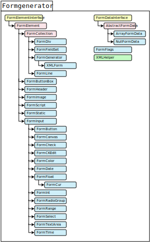

# Class reference for the Formgenerator package

## The Class hierarchie
The package is structured with the following class hierarchy:

<map name="Formgenerator-map">
    <area target="" alt="FormElementInterface" title="FormElementInterface" href="#FormElementInterface" coords="25,54,177,82" shape="rect">
    <area target="" alt="FormElement" title="FormElement" href="#FormElement" coords="64,87,189,111" shape="rect">
    <area target="" alt="FormCollection" title="FormCollection" href="#FormCollection" coords="101,118,228,142" shape="rect">
    <area target="" alt="FormDiv" title="FormDiv" href="#FormDiv" coords="142,149,266,172" shape="rect">
    <area target="" alt="FormFieldSet" title="FormFieldSet" href="#FormFieldSet" coords="141,179,267,204" shape="rect">
    <area target="" alt="FormGenerator" title="FormGenerator" href="#FormGenerator" coords="141,211,266,234" shape="rect">
    <area target="" alt="XMLForm" title="XMLForm" href="#XMLForm" coords="181,243,307,265" shape="rect">
    <area target="" alt="FormLine" title="FormLine" href="#FormLine" coords="142,273,268,297" shape="rect">
    <area target="" alt="FormButtonBox" title="FormButtonBox" href="#FormButtonBox" coords="103,304,229,327" shape="rect">
    <area target="" alt="FormHeader" title="FormHeader" href="#FormHeader" coords="103,335,229,358" shape="rect">
    <area target="" alt="FormImage" title="FormImage" href="#FormImage" coords="102,365,229,389" shape="rect">
    <area target="" alt="FormScript" title="FormScript" href="#FormScript" coords="103,396,229,422" shape="rect">
    <area target="" alt="FormStatic" title="FormStatic" href="#FormStatic" coords="102,429,229,451" shape="rect">
    <area target="" alt="FormInput" title="FormInput" href="#FormInput" coords="102,459,228,482" shape="rect">
    <area target="" alt="FormButton" title="FormButton" href="#FormButton" coords="142,489,265,513" shape="rect">
    <area target="" alt="FormCanvas" title="FormCanvas" href="#FormCanvas" coords="142,522,266,545" shape="rect">
    <area target="" alt="FormCheck" title="FormCheck" href="#FormCheck" coords="144,552,267,576" shape="rect">
    <area target="" alt="FormCKEdit" title="FormCKEdit" href="#FormCKEdit" coords="144,584,266,607" shape="rect">
    <area target="" alt="FormColor" title="FormColor" href="#FormColor" coords="141,615,265,638" shape="rect">
    <area target="" alt="FormDate" title="FormDate" href="#FormDate" coords="141,646,266,668" shape="rect">
    <area target="" alt="FormFloat" title="FormFloat" href="#FormFloat" coords="142,677,266,699" shape="rect">
    <area target="" alt="FormCur" title="FormCur" href="#FormCur" coords="181,708,305,731" shape="rect">
    <area target="" alt="FormInt" title="FormInt" href="#FormInt" coords="142,738,266,761" shape="rect">
    <area target="" alt="FormRadioGroup" title="FormRadioGroup" href="#FormRadioGroup" coords="143,769,266,792" shape="rect">
    <area target="" alt="FormRange" title="FormRange" href="#FormRange" coords="142,800,266,823" shape="rect">
    <area target="" alt="FormSelect" title="FormSelect" href="#FormSelect" coords="142,832,265,854" shape="rect">
    <area target="" alt="FormTextArea" title="FormTextArea" href="#FormTextArea" coords="141,863,265,885" shape="rect">
    <area target="" alt="FormTime" title="FormTime" href="#FormTime" coords="141,894,266,917" shape="rect">
    <area target="" alt="FormDataInterface" title="FormDataInterface" href="#FormDataInterface" coords="375,55,522,78" shape="rect">
    <area target="" alt="AbstractFormData" title="AbstractFormData" href="#AbstractFormData" coords="413,86,538,109" shape="rect">
    <area target="" alt="ArrayFormData" title="ArrayFormData" href="#ArrayFormData" coords="453,118,577,141" shape="rect">
    <area target="" alt="NullFormData" title="NullFormData" href="#NullFormData" coords="451,149,577,171" shape="rect">
    <area target="" alt="FormFlags" title="FormFlags" href="#FormFlags" coords="374,180,522,204" shape="rect">
    <area target="" alt="XMLHelper" title="XMLHelper" href="#XMLHelper" coords="374,212,522,235" shape="rect">
</map>

### The Formelements

#### FormElementInterface <a name="FormElementInterface"/>
This is the basic interface on which all available elements are based.

#### FormElement <a name="FormElement"/>
The abstract class contains all methods that are needed by each of the available 
elements.

#### FormCollection <a name="FormCollection"/>
This abstract class ist the base for all structural elements and can hold any count 
of child elements of any element class to arrange the form elements in cols, fieldsets 
and lines. The FormGenerator class itself is also a collection element since it is 
the starting point for each form.

#### FormDiv <a name="FormDiv"/>

#### FormFieldSet <a name="FormFieldSet"/>

#### FormGenerator <a name="FormGenerator"/>

#### XMLForm <a name="XMLForm"/>

#### FormLine <a name="FormLine"/>

#### FormButtonBox <a name="FormButtonBox"/>

#### FormHeader <a name="FormHeader"/>

#### FormImage <a name="FormImage"/>

#### FormScript <a name="FormScript"/>

#### FormStatic <a name="FormStatic"/>

#### FormInput <a name="FormInput"/>

#### FormButton <a name="FormButton"/>

#### FormCanvas <a name="FormCanvas"/>

#### FormCheck <a name="FormCheck"/>

#### FormCKEdit <a name="FormCKEdit"/>

#### FormColor <a name="FormColor"/>

#### FormDate <a name="FormDate"/>

#### FormFloat <a name="FormFloat"/>

#### FormCur <a name="FormCur"/>

#### FormInt <a name="FormInt"/>

#### FormRadioGroup <a name="FormRadioGroup"/>

#### FormRange <a name="FormRange"/>

#### FormSelect <a name="FormSelect"/>

#### FormTextArea <a name="FormTextArea"/>

#### FormTime <a name="FormTime"/>

#### FormDataInterface <a name="FormDataInterface"/>

#### AbstractFormData <a name="AbstractFormData"/>

#### ArrayFormData <a name="ArrayFormData"/>

#### NullFormData <a name="NullFormData"/>

#### FormFlags <a name="FormFlags"/>

#### XMLHelper <a name="XMLHelper"/>

